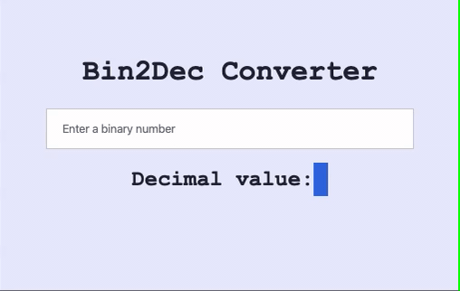
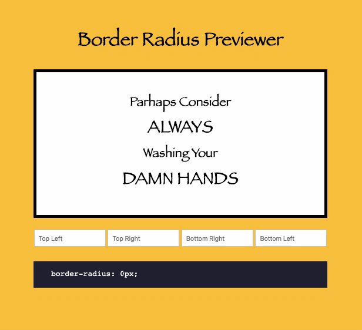
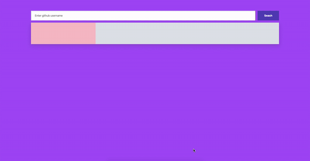
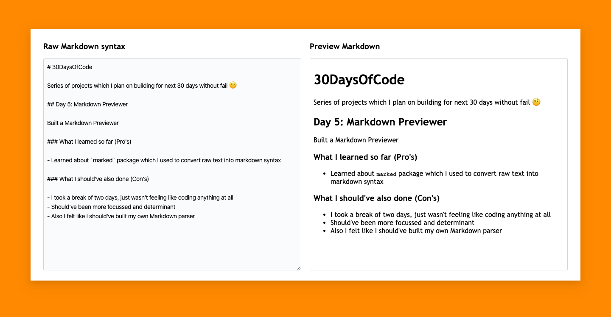
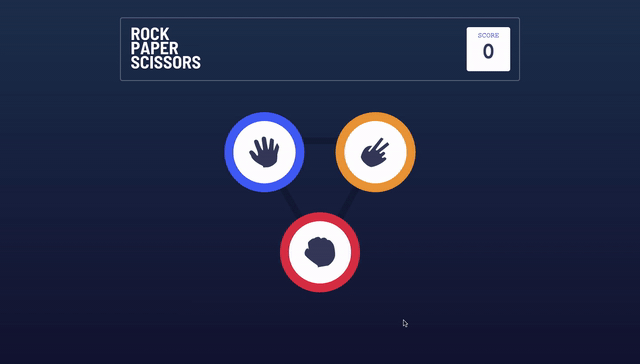
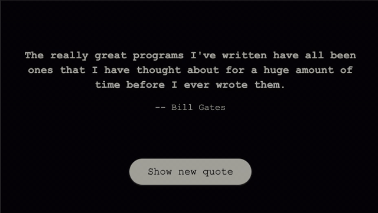

# 30DaysOfCode

Series of projects which I plan on building for the next 30 days without fail 🤨

## Day 1: Bin2Dec

Built a Binary 2 Decimal converter

### What I learned so far (Pros)

- I learned the `parseInt()` function and how it takes in string/number argument and returns an integer of the specified `radix` (the base in mathematical numeral systems)
- In the above app I passed a `radix` or `base` of 2 specifying functions should return a Decimal value

### What I should've also done (Con's)

- I should've added regex validation for the input field rather than `alert`ing a message when keycode is not `0 or 1`

## Day 2: Border Radius Previewer

Built a Border Radius Previewer

### What I learned so far (Pros)

- I learned the `getComputedStyle()` method and how it returns an object containing the values of all CSS properties of an element, after applying active stylesheets and resolving any basic computation those values may contain.
- In above project I used `getComputedStyle()` to get current styling properties of `border-radius` which I was able to target through the `getPropertyValue()` method

### What I should've also done (Cons)

- Maybe I should've used functions to change border styling instead hard coding values 😅
- Also I should've added the ability to copy the border-radius property on click

## Day 3: Calculator

Today I built a calculator (I was barely able 😅)

### What I learned so far (Pros)

- I learned about the `eval()` method evaluates JavaScript code represented as a string

### What I should've also done (Cons)

- I initially started out thinking of implementing switch cases for each operation, but eventually I got lazy and used the `eval()` function to return the calculated result

## Day 4: GitHub Profiler

Built a GitHub Profile loader, used GitHub users API 😃

### What I learned so far (Pros)

- I learned not to be lazy 😅, learned about GitHub Users API

### What I should've also done (Con's)

- Should've added better error handling operation. A better way to handle DOM manipulation

## Day 5: Markdown Previewer

Built a Markdown Previewer

### What I learned so far (Pros)

- Learned about the `marked` package which I used to convert raw text into markdown syntax

### What I should've also done (Cons)

- I took a break of two days, just wasn't feeling like coding anything at all
- Should've been more focussed and determinant
- Also I felt like I should've built my own Markdown parser

## Day 6: Rock Paper Scissors Game

Built a Rock Paper Scissors Game. Used design resources from @frontendmentorio challenge

### What I learned so far (Pros)

- Learned about rules of Rock Paper Scissors Game, there wasn't much in tech I could learn programmatically

### What I should've also done (Cons)

- Maybe simplified how we toggle UI elements
- Store the score in `localStorage` and make it persistent
- Add animation to DOM manipulation

## Day 7: Color Scheme Toggler

Built a Color Scheme Toggler

### What I learned so far (Pros)

- Learned about color schemes, how we can use it in our applications etc

### What I should've also done (Con's)

- Should've used CSS variables to defines primary/secondary colors
- Store the toggles mode in `localStorage` to make it persistent and render it whenever we load the page

## Day 8: Random Meal Generator

Built a Random Meal Generator

### What I learned so far (Pros)

- Learned about the `themealdb` API, and how we can use this API to build apps for food-related stuff

### What I should've also done (Cons)

- Should've added CSS transition for smooth animation

## Day 9: Random Programming Quote Generator

Built a Random Programming Quote Generator

### What I learned so far (Pros)

- Learned about [Programming Quotes API](https://programming-quotes-api.herokuapp.com/) which provides tons of options to load programming-related quotes.

### What I should've also done (Con's)

- Make more accessible UI (voiceOver)

## Day 10: Simple FAQ accordion

Built a simple FAQ accordion

### What I learned so far (Pros)

- Not much actually, this project is me trying to do a come back from a long gap

### What I should've also done (Cons)

- I should be more consistent

## Day 11: Easy Pagination

Built a simple pagination component

### What I learned so far (Pros)

- Learnt a bit about array manipulation

### What I should've also done (Cons)

- Built a complex pagination UI with multipage support

## Day 12: Easy Pagination

Built a random cat facts page

### What I learned so far (Pros)

- Learnt about [cat-facts](https://alexwohlbruck.github.io/cat-facts/]) endpoint which returns a random fact about cats
- Re-used the same functional code in 2 differnt event handlers

### What I should've also done (Cons)

- NA
