# 30DaysOfCode

Series of projects which I plan on building for the next 30 days without fail 🤨

## Day 1: Bin2Dec

Built a Binary 2 Decimal converter

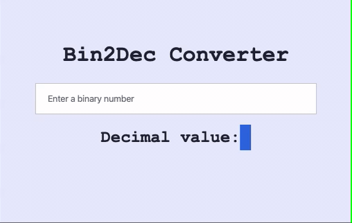

### What I learned so far (Pros)

- I learned the `parseInt()` function and how it takes in string/number argument and returns an integer of the specified `radix` (the base in mathematical numeral systems)
- In the above app I passed a `radix` or `base` of 2 specifying functions should return a Decimal value

### What I should've also done (Con's)

- I should've added regex validation for the input field rather than `alert`ing a message when keycode is not `0 or 1`

## Day 2: Border Radius Previewer

Built a Border Radius Previewer

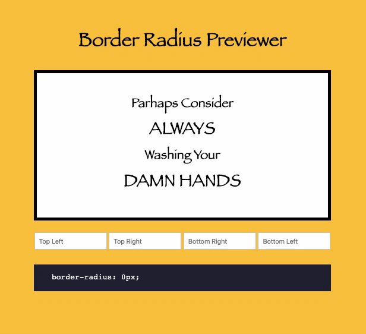

### What I learned so far (Pros)

- I learned the `getComputedStyle()` method and how it returns an object containing the values of all CSS properties of an element, after applying active stylesheets and resolving any basic computation those values may contain.
- In above project I used `getComputedStyle()` to get current styling properties of `border-radius` which I was able to target through the `getPropertyValue()` method

### What I should've also done (Cons)

- Maybe I should've used functions to change border styling instead hard coding values 😅
- Also I should've added the ability to copy the border-radius property on click

## Day 3: Calculator

Today I built a calculator (I was barely able 😅)

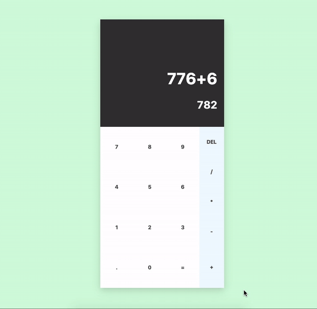

### What I learned so far (Pros)

- I learned about the `eval()` method evaluates JavaScript code represented as a string

### What I should've also done (Cons)

- I initially started out thinking of implementing switch cases for each operation, but eventually I got lazy and used the `eval()` function to return the calculated result

## Day 4: GitHub Profiler

Built a GitHub Profile loader, used GitHub users API 😃

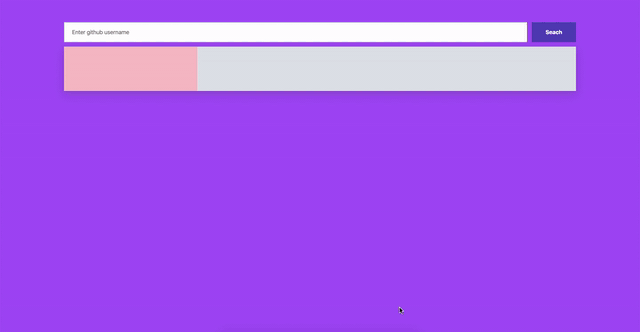

### What I learned so far (Pros)

- I learned not to be lazy 😅, learned about GitHub Users API

### What I should've also done (Con's)

- Should've added better error handling operation. A better way to handle DOM manipulation

## Day 5: Markdown Previewer

Built a Markdown Previewer

### What I learned so far (Pros)

- Learned about the `marked` package which I used to convert raw text into markdown syntax

### What I should've also done (Cons)

- I took a break of two days, just wasn't feeling like coding anything at all
- Should've been more focussed and determinant
- Also I felt like I should've built my own Markdown parser

## Day 6: Rock Paper Scissors Game

Built a Rock Paper Scissors Game. Used design resources from @frontendmentorio challenge

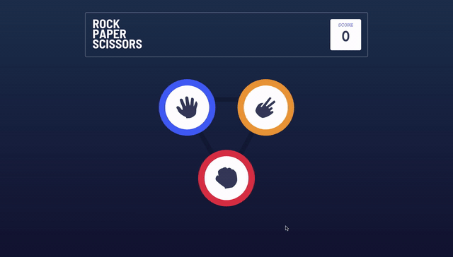

### What I learned so far (Pros)

- Learned about rules of Rock Paper Scissors Game, there wasn't much in tech I could learn programmatically

### What I should've also done (Cons)

- Maybe simplified how we toggle UI elements
- Store the score in `localStorage` and make it persistent
- Add animation to DOM manipulation

## Day 7: Color Scheme Toggler

Built a Color Scheme Toggler

### What I learned so far (Pros)

- Learned about color schemes, how we can use it in our applications etc

### What I should've also done (Con's)

- Should've used CSS variables to defines primary/secondary colors
- Store the toggles mode in `localStorage` to make it persistent and render it whenever we load the page

## Day 8: Random Meal Generator

Built a Random Meal Generator

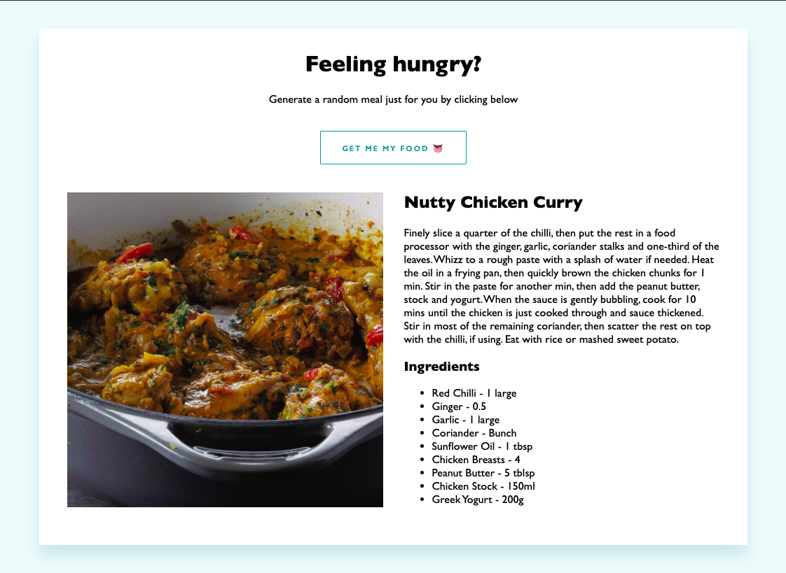

### What I learned so far (Pros)

- Learned about the `themealdb` API, and how we can use this API to build apps for food-related stuff

### What I should've also done (Cons)

- Should've added CSS transition for smooth animation

## Day 9: Random Programming Quote Generator

Built a Random Programming Quote Generator

### What I learned so far (Pros)

- Learned about [Programming Quotes API](https://programming-quotes-api.herokuapp.com/) which provides tons of options to load programming-related quotes.

### What I should've also done (Con's)

- Make more accessible UI (voiceOver)

## Day 10: Simple FAQ accordion

Built a simple FAQ accordion

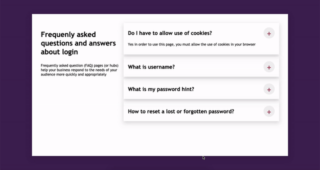

### What I learned so far (Pros)

- Not much actually, this project is me trying to do a come back from a long gap

### What I should've also done (Cons)

- I should be more consistent

## Day 11: Easy Pagination

Built a simple pagination component

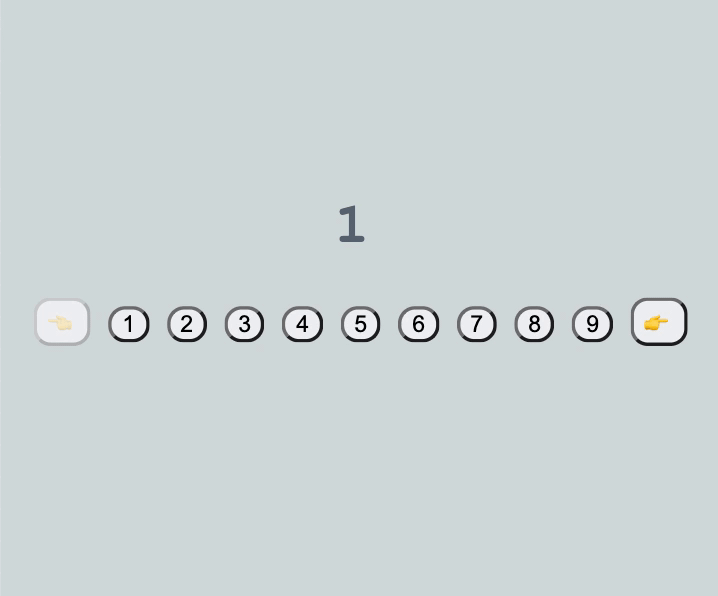

### What I learned so far (Pros)

- Learnt a bit about array manipulation

### What I should've also done (Cons)

- Built a complex pagination UI with multipage support

## Day 12: Random Cat Facts

Built a random cat facts page

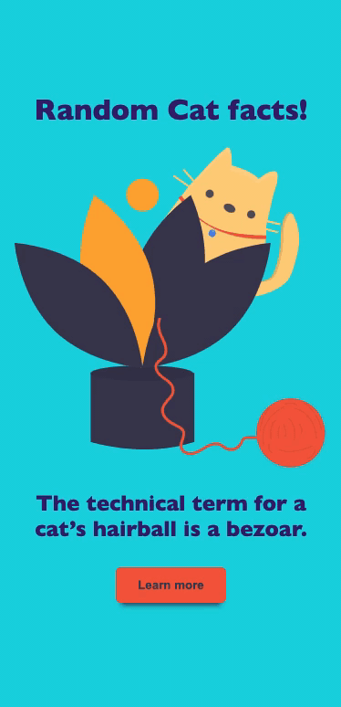

### What I learned so far (Pros)

- Learnt about [cat-facts](https://alexwohlbruck.github.io/cat-facts/]) endpoint which returns a random fact about cats
- Re-used the same functional code in 2 differnt event handlers

### What I should've also done (Cons)

- NA

## Day 13: Table of contents

Built a table of content generator from the html markup present in the page

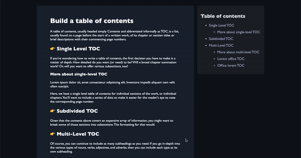

### What I learned so far (Pros)

- Learned about how we can add/append multiple child node to an element in DOM using `appendChild` method

### What I should've also done (Cons)

- Auto highlight table of content links whenever user scroll down the page showcasing the progress of the page

## Day 14: Tooltip element

Built a Tooltip element

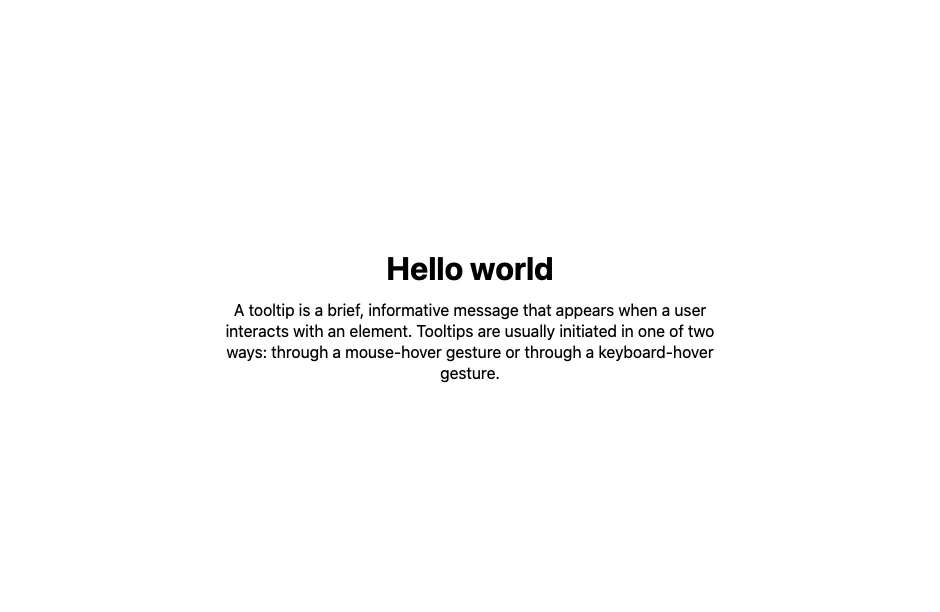

### What I learned so far (Pros)

- Used `mouseover` & `mouseleave` event listeners
- Learned about `remove()` built-in method to remove any child node from the dom tree
- Started using querySelector to select element with different attributes

### What I should've also done (Cons)

- Should've applied the positioning of the tooltip automatically using the elements placement in the page
- Added some transition to the tooltop

## Day 15: Search Box

Built a search box component

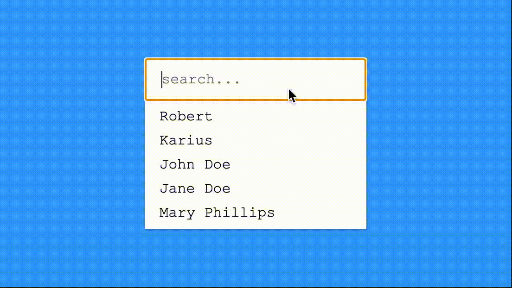

### What I learned so far (Pros)

- Learned about `Element.replaceChildren` method, which replaces the existing children of a Node with a specified new set of children.

### What I should've also done (Cons)

- NA

## Day 16: Feedback form

Built a feedback form component

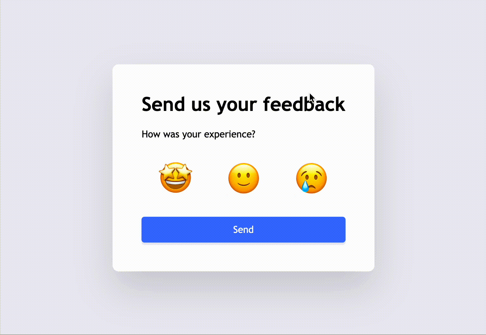

### What I learned so far (Pros)

- Learned about querySelector option to select input fields with same name attribute
- Learned about how to select immediate sibling of element and apply style to it using `+` adjacent selector

### What I should've also done (Cons)

- Use some endpoint to post the feedback data asynchronously

## Day 17: Cookie popup

Built a cookie popup component

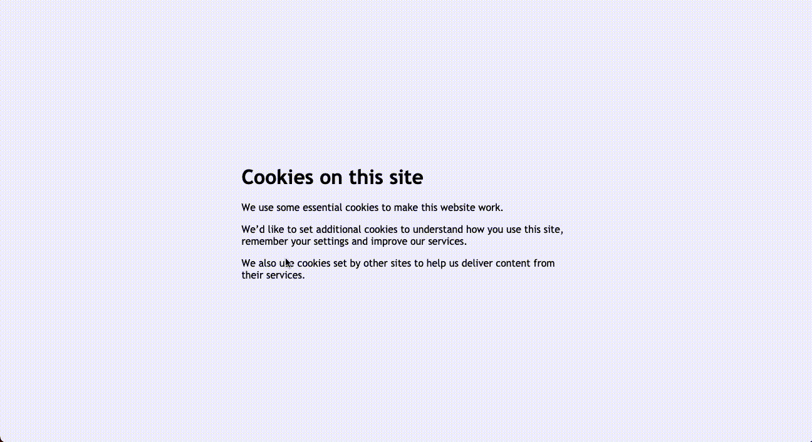

### What I learned so far (Pros)

- Learned about `document.cookie`, how we can use it in any JS projects

### What I should've also done (Cons)

- Made some static changes when a cookie is stored

## Day 18: Modal

Built a modal component

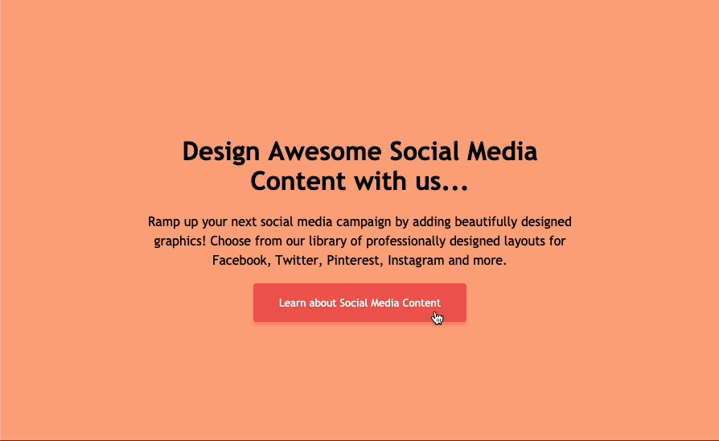

### What I learned so far (Pros)

- Learned about `currentTarget` of click event and how we can use it to check of which element is being clicked at the moment

### What I should've also done (Cons)

- Add some animation to the modal

## Day 19: URL Shortner

Built a URL shortner

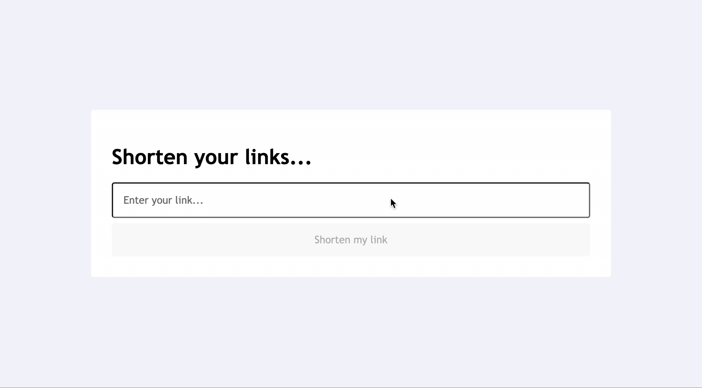

### What I learned so far (Pros)

- Learned about `*:hover:enabled` and `*:hover:dinabled` CSS pseudo-selectors to add hover state style when element is disabled on enabled

### What I should've also done (Cons)

- NA

## Day 20: Menu component

Built a Menu component

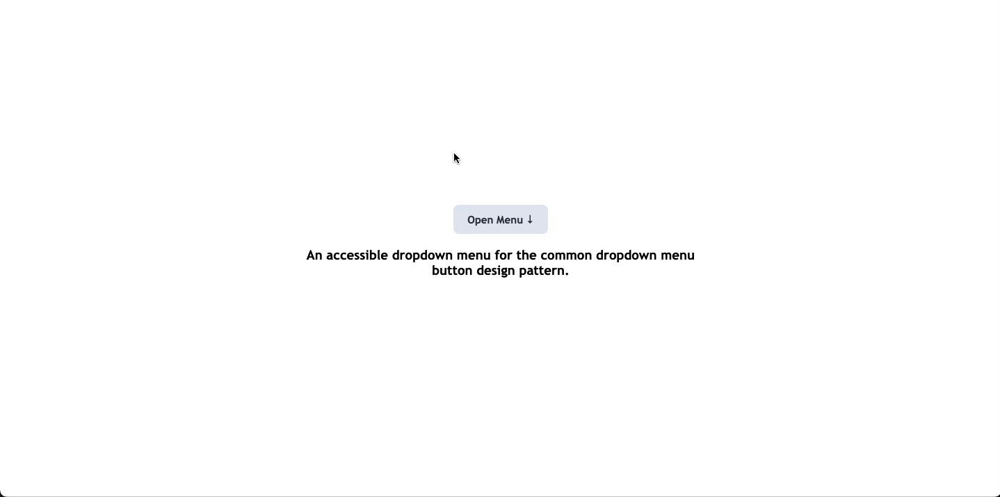

### What I learned so far (Pros)

- Nothing new! ☹️

### What I should've also done (Cons)

- Component should've been dynamic
- Should've used `insertAdjacentElement` method to add menu node to DOM
- Should've added option to close menu when focus is moved away from the button

## Day 21: Timeline component

Built a Timeline component

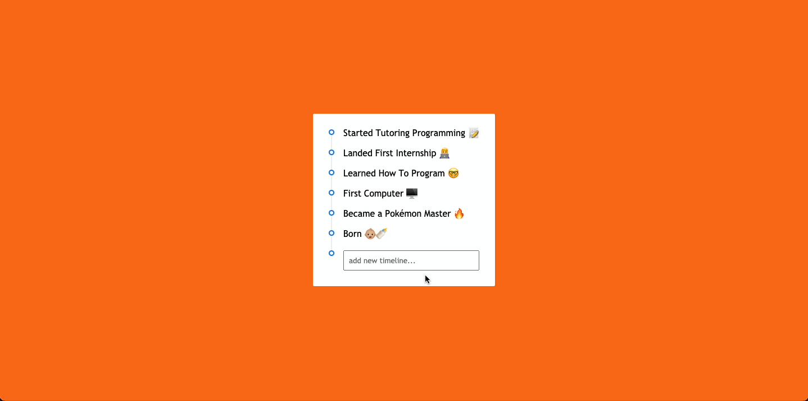

### What I learned so far (Pros)

- Nothing new 🥲

### What I should've also done (Cons)

- Should've added transition

## Day 22: Tabs component

Built a Tabs component

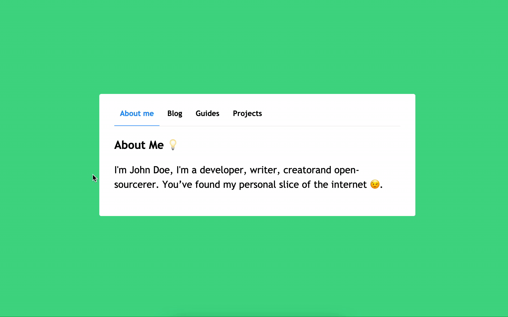

### What I learned so far (Pros)

- Learned about `Element.classList.add()`, `Element.classList.remove()` and `Element.classList.toggle()` functions
- Used `Element.classList.add` and `Element.classList.remove` to toggle active tab

### What I should've also done (Cons)

- Should've added transition
- Should've tried to simplify class change using `Element.classList.toggle()` function

## Day 23: Carousel component

Built a Carousel component

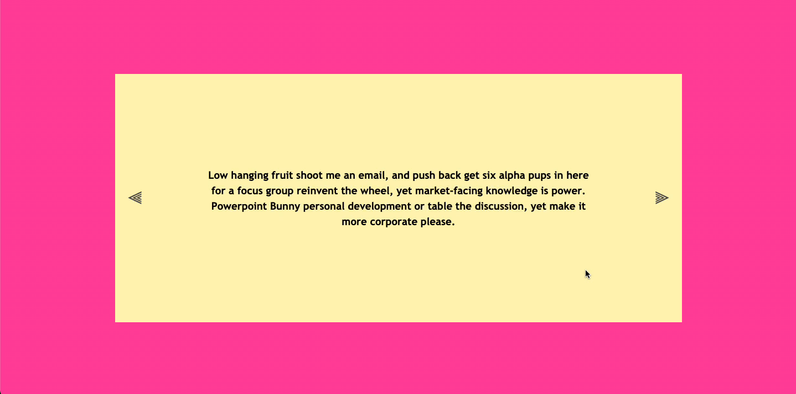

### What I learned so far (Pros)

- Learned about `Element.previousElementSibling`, `Element.firstElementChild`, `Element.nextElementSibling` and `Element.lastElementChild` properties
- Used above element properties to handle change in active carousel

### What I should've also done (Cons)

- Should've cleaned transitions

## Day 24: Random Quiz

Built a Random Quiz App

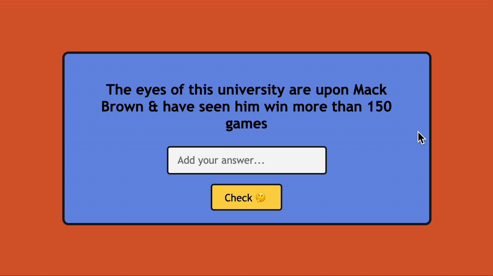

### What I learned so far (Pros)

- Tried something new! Used `filter: blur()` CSS property to showcase the data loading effect

### What I should've also done (Cons)

- Should've disabled the form when data is loading

## Day 25: Emoji Picker

Built a Emoji Picker with a slight pop up animation

### What I learned so far (Pros)

- Tried something new 🔥
- Used `insertAdjacentElement` method to insert emoji list to DOM
- Used `Math.random()` to generate few unique position points in DOM for emoji drop animation

### What I should've also done (Cons)

- NA, I feel okay with overall result

## Day 26: Highlight Words

Built a Word highlighter

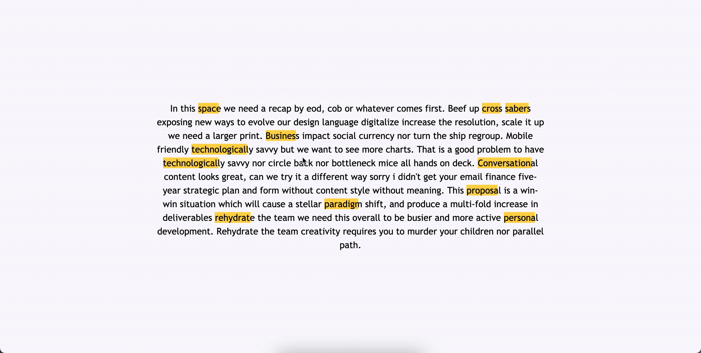

### What I learned so far (Pros)

- Used some of the `transform` css properties

### What I should've also done (Cons)

- Need to learn more about `transform` and `animation` properties
